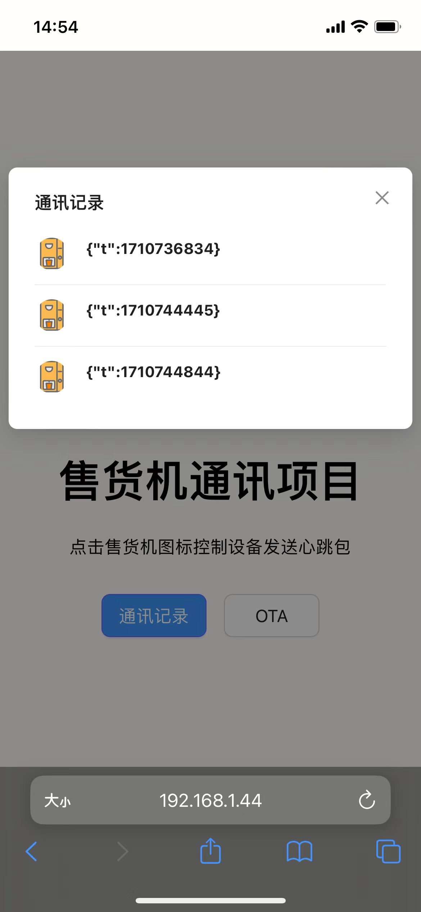

## 介绍

mqtt demo应用，实现mqtt的通讯数据加密传输和OTA的流程实现，项目分为四个部分，分别为mqtt-server-example,mqtt-client-example,express后端服务和vite+react前端应用

## 运行

### 运行mqtt服务器

```bash
cd mqtt-server-example
npm install
npm run index.js
```
console输出：
```bash
server started and listening on port  1883
```
可监听客户端连接和断开

### 运行express服务

```bash
cd server-example
npm install
npm run index.js
```
启动express服务并连接mqtt服务器，订阅相关主题，console输出：
```bash
connect mqtt server
Listening HTTP: http://localhost:3030
mqtt connect successfully
subscribe to topic: /topic/data
subscribe to topic: /things/thing_test/jobs/+/update
```

### 运行前端页面

```bash
cd server-example/vite-app
npm install
npm run dev
```
console输出：
```bash
  VITE v5.1.6  ready in 182 ms

  ➜  Local:   http://localhost:5173/
  ➜  Network: http://192.168.1.44:5173/
```
局域网移动端打开页面：


### 运行mqtt设备端模拟器

```bash
cd mqtt-client-example
python client.py
```
模拟客户端设备运行，订阅相关主题，并率先上报心跳包，AES对称加密后发送密文，console输出：
```bash
Connected with result code 0
subscribe to topic:/things/thing_test/job
subscribe to topic:/topic/heart
publish payload 7b3b0fde391654c35b1ff2c712086cb7 to topic /topic/data
publishing~~, 原文:b'{"t":1710744445}', 密文:7b3b0fde391654c35b1ff2c712086cb7
```

服务器端收到设备上报密文后解密并进行存储（文件形式），console输出：
```bash
收到数据, topic:/topic/data, 原文:7b3b0fde391654c35b1ff2c712086cb7, 解密后：{"t":1710744445}
```

## 使用
页面接入4个API，分别为：
##### 一. GET /messages
查看设备端与服务器历史通讯记录
##### 二. POST /message
发布消息，控制设备端主动上报心跳包，可通过页面查看

###### 1. 调用POST /message后，服务端发布消息到心跳包topic，console输出：
```bash
publish data to /topic/heart
```
###### 2. 设备端收到数据，主动发送心跳包，使用AES对称加密，设备端console输出：
```bash
receive data:b'',topic:/topic/heart
publish data to server
publish payload 2450f80603555cb68338592bacd66df5 to topic /topic/data
publishing~~, 原文:b'{"t":1710745731}', 密文:2450f80603555cb68338592bacd66df5
```
###### 3. 客户端解密，console输出：
```bash
收到数据, topic:/topic/data, 原文:2450f80603555cb68338592bacd66df5, 解密后：{"t":1710745731}
```
###### 4. 页面



##### 三. GET /ota/updates
查看设备历史OTA记录，包含服务端下发的数据及设备端上报的结果
##### 四. POST /ota/updates
选择目标版本，创建新的OTA作业下发到设备端执行,服务端创建random job-id

###### 1. 下发作业后设备端console：
```bash
receive data:b'{"job":{"id":"ota-random-8","url":"https://192.168.1.44","toVersion":"0.0.2","status":"IN_PROGRESS"}}',topic:/things/thing_test/job
job message, check and do OTA...
do OTA, wait 5 sec...
OTA succeeded, publish message...
```

###### 2. OTA完成后上报结果，服务端console输出：
```bash
收到数据, topic:/things/thing_test/jobs/ota-random-8/update, payload:{"version": "0.0.2", "status": "SUCCEEDED", "ts": 1710745309}
```

###### 3.页面


